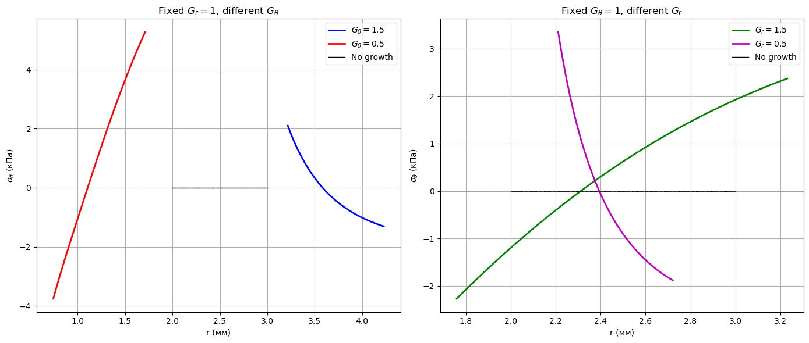

# Morphoelastic Model for Residual Stresses in Growing Arterial Tissues

This repository implements a computational framework for analyzing residual stresses in growing cylindrical vessels (like arteries) using morphoelasticity theory. The Python scripts solve nonlinear mechanics equations and visualize stress distributions under different growth scenarios, based on Taber's "Continuum Modeling in Mechanobiology" (Chapter 6).

## Installation

To run the analysis, you'll need Python with these scientific libraries:

```bash
pip install numpy scipy matplotlib
```

## Usage

1. Clone the repository:
```bash
git clone https://github.com/karinaurazova/growth_artery_with_residual_stress.git
```

2. Run the main analysis script:
```python
python growth_artery_with_residual_stress.ipynb
```

## Theory

### Core Equations

The model implements these key equations for an incompressible, orthotropic cylindrical vessel:

1. **Kinematics**:
```math
   \mathbf{F} = \mathbf{F}^* \mathbf{G}, \quad J^* = \det \mathbf{F}^* = 1
```
3. **Radial Mapping**:
```math
   r(R) = \left( a^2 + \frac{2}{\lambda}\int_{a_0}^R J_G R dR \right)^{1/2}
```
4. **Elastic Stretches**:
```math
   \lambda_r^* = \frac{1}{G_r}\frac{\partial r}{\partial R}, \quad \lambda_\theta^* = \frac{1}{G_\theta}\frac{r}{R}, \quad \lambda_z^* = \frac{\lambda}{G_z}
```
5. **Strain Energy** (Rabbit aorta model):
```math
   \psi^* = c(\exp Q^* - 1), \quad Q^* = \sum \alpha_i E_i^{*2} + 2\sum \alpha_{ij} E_i^*E_j^*
```
### Numerical Solution

The code:
1. Computes deformed geometry via numerical integration
2. Calculates elastic stretches using finite differences
3. Solves the nonlinear equilibrium system for parameters $\(a\) and \(\lambda\)$
4. Integrates to find residual stress distributions

## Results

Example stress distributions for different growth scenarios:



## Key Features

- Implements morphoelastic growth theory for cylindrical vessels
- Solves coupled nonlinear integral equations
- Visualizes stress distributions under different growth patterns
- Configurable for various material parameters

## References

Based on theoretical framework from:
Taber, L. (2020). *Continuum Modeling in Mechanobiology*. Springer. [DOI](https://doi.org/10.1007/978-3-030-43209-6)

## Contributing

Suggestions and improvements are welcome via pull requests or issues. For direct contact: karina_urazova@icloud.com

**This framework provides a computational tool for studying growth-induced stresses in arterial tissues, with potential applications in vascular mechanics and mechanobiology research.**
